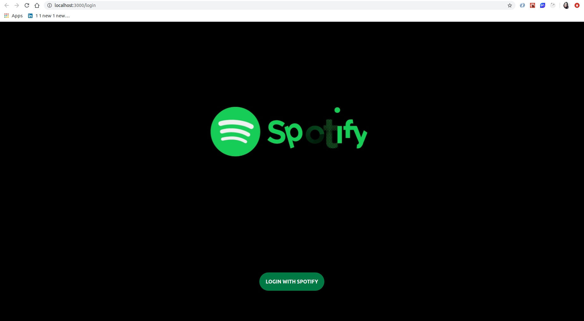
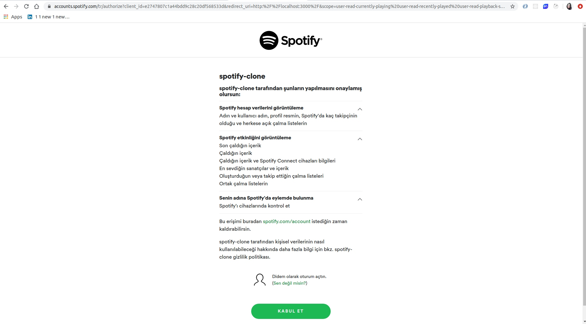
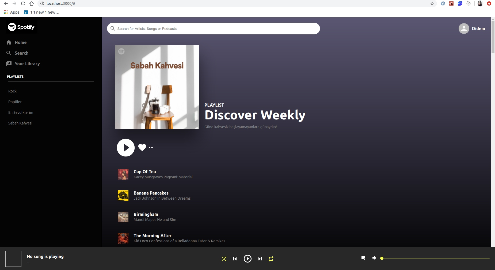

# How to Get Started

```sh
$ git clone https://github.com/didemkaraaslan/Spotify.git
$ cd /Spotify
$ npm install
$ npm start
```

# Note

For app the perform some functionality ( play song ) you must hava a premium account. Otherwise it's alllrighty!

# ScreenShots

## Login Screen



## Spotify Authentication Screen



## Dashboard Screen



# A Quote from Dan Abromov

> "Things that are traditionally sync don’t have to “feel” sync. Things that are traditionally async don’t have to “feel” async. Be intentional and bridge the gap when you need."

### Tech

Spotify Clone uses a number of libraries.

- [ReactJS] - Frontend Library for awesome apps!
- [Material UI] - Beautiful icons

Also;
This project uses new React Context API with the useReducer hook ! DAMN LOVE IT.
